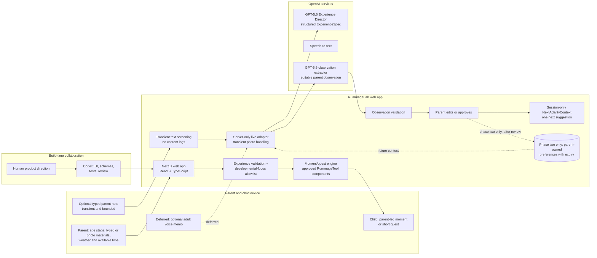

# RummageLab

> Turn the things around you into moments of discovery for ages 0–6.

**Status:** Deterministic seeded demo plus an optional, default-off live GPT-5.6 path that vets any parent-approved object and authors an age-, weather-, and object-appropriate activity · **Track:** Education

RummageLab helps a parent turn a few ordinary objects and a child’s curiosity
into a developmentally appropriate moment of discovery. Every activity ends with
something the child noticed, made, heard, measured, or explained—not another
chat transcript.

## The core experience

1. In the implemented demo, a parent uses a prepared kit, an object-photo
   preview followed by optional live analysis, or a small typed-material allowlist, then confirms the
   same safe material inventory. The visible **Anchorage, Alaska** label and
   broad weather chips are prepared demo context—not a lookup or family location.
2. The server-only runtime accepts only a parent-approved `ActivityContext` and
   returns a Zod-validated `ExperienceSpec`. On the **seeded prepared kit** this is
   the deterministic Kitchen Sound quest with no model call. On the **live
   photo/typed path** (ages 3–4), GPT-5.6 vets the objects and then *authors* a
   full activity tailored to the confirmed objects, weather, and age; the server
   re-validates it against the parent-approved context—materials must be a subset
   of the confirmed categories, developmental-focus IDs must be in the local
   catalogue, every step must fit the time window, and the tool must be one of five
   prebuilt renderers—before it ever reaches the child. Missing credentials, a
   disabled switch, provider failure, or a rejected activity fall back to a reviewed
   template. The activity screen shows an honest provenance badge (generated live,
   prepared demo, or prepared fallback) and a one-line summary.
3. For children 3+, RummageLab can render an approved interactive
   **RummageTool**. For younger children, it gives the parent a simple co-play
   script rather than putting the child in front of a screen.
4. After the quest, the parent may skip reflection, use the prepared example,
   or type a short parent-only observation. A deterministic browser guard blocks
   likely sensitive details before any request. The server repeats strict
   validation and returns only an editable, Zod-validated observation draft and
   allowlisted tag suggestions. Nothing shapes the one next idea until the
   parent explicitly approves the edited tags. Adult voice remains deferred.

The first implemented experience is **“Kitchen Sound Detectives.”** A parent can
use the prepared kit, preview a new object-only photo before optional analysis, or type material
names. Every path converges on the same parent confirmation for the large empty
plastic container, wooden utensil, soft cloth, suggested Anchorage weather
tags, and safety checkpoint. The app then renders a validated `sound_mix`
quest, an optional typed or prepared parent observation, and at most one session-only
try-next idea made only from parent-approved tags.

### Two paths: a seeded golden path and an adaptive live path

For the hackathon, the **seeded prepared-kit path is the reliable golden path**:
it needs no key, makes no model call, and always renders the same validated
Kitchen Sound Detectives quest. Judges can run the entire experience—intake,
confirmation, activity, reflection, and one next idea—with nothing configured.

The optional **live path** showcases the adaptive nature of GPT-5.6. A parent can
photograph or type *any* ordinary object, not just a fixed list. GPT-5.6 suggests
a short label, a coarse category, a safety level, and up to three parent cautions
for each object. A local **hard denylist** removes clearly hazardous items
(choking, sharp, cords, batteries, glass, and similar) before a parent ever sees
them, on both the client prefilter and the server; the parent then confirms each
object. Once the context is parent-approved, GPT-5.6 authors a bespoke activity
that references the real objects by name and fits the age and weather. Nothing the
model authors reaches a child without passing (1) the local hard denylist, (2)
strict Zod plus context re-validation, and (3) the parent's confirmation—so the
adaptive path keeps the same safety floor as the seeded one.

The prepared-kit path remains deliberately labeled as seeded and needs no key.
For live photo analysis, the parent must confirm that the image contains objects
only. The server validates and re-encodes the transient JPEG, PNG, or WebP in
memory to strip metadata, but only after the server-side live switch is enabled.
When disabled, the photo UI keeps a local preview but does not upload it or fill
prepared photo candidates. The multipart parser enforces an 8 MB photo limit and
a 9 MB total request limit while reading the stream, even when `Content-Length`
is absent or false. The server sends the sanitized image once with `store: false`
and retains neither the upload nor provider response. Typed names still use a local deterministic
allowlist; only parent-confirmed categories enter planning. Typed reflection is
bounded, screened before a request, never logged or persisted, and discarded
after transient extraction. Without a key, or when extraction fails, the app
transparently offers the validated prepared observation instead. There is no
live weather, voice, analytics, authentication, or database. Resetting or
reloading clears session state.

## Architecture



See [the detailed architecture](docs/architecture.md).

## Why GPT-5.6 and Codex

### GPT-5.6 runtime

- Vets any parent-approved object and authors a constrained, developmentally
  appropriate activity tailored to the confirmed objects, age, and weather—then
  re-validated server-side before it reaches the child.
- Returns structured data that the server validates before it reaches the child.
- Turns a parent reflection into a small, editable observation rather than a
  child diagnosis or opaque score.

### Codex collaboration

- **Core `/feedback` Session ID:** `019f6671-c7e4-7cc1-af9a-1bc7b21370af`
- **Codex accelerated:** project scaffolding, interaction design, schemas,
  tests, documentation, and code review.
- **Human decisions:** learner scope, standards allowlist, safety/privacy
  boundaries, product direction, and final approval.
- **Evidence:** dated commits and [Codex decision log](docs/codex-decisions.md).

For the hackathon, Codex is used materially at build time to create and verify
the product. The live runtime authors a full `QuestSpec` that is re-validated
against the parent-approved context and may render only one of five prebuilt,
non-recording React `RummageTool` components; it never executes arbitrary
generated code. The seeded path uses the same validation boundary without
requiring credentials. A teacher/parent authoring studio is documented phase-two
scope; even then, the learner app will never execute arbitrary generated code.

## Technology choices

| Concern | Choice | Why |
| --- | --- | --- |
| Product surface | Next.js, React, TypeScript | Fast public deployment, phone-friendly, easy judge access |
| Source and hosting | Public [GitHub repository](https://github.com/hqt08/RummageLab) + [Vercel demo](https://rummage-lab.vercel.app/) | Reviewable source and a stable seeded production URL |
| Model contracts | GPT-5.6 + Zod structured schemas | Consistent, inspectable, parent-safe rendering boundaries |
| Reflection MVP | Optional typed parent note or Skip; voice deferred | Deterministic screening, strict structured output, explicit tag approval |
| Data | Seeded, no-login parent context; preferences later | Keeps the demo reliable without sensitive child data |
| Weather | Anchorage demo default suggests tags; parent approves | Convenient live context without sending location to the model |
| Interactive activity | Prebuilt React RummageTool components | Instant, safe, testable experience |
| Styling | CSS field-notebook design system | Tactile and playful without a generic AI interface |

## Scaffold setup

Prerequisite: Node.js 24 LTS and Corepack using the project-pinned
`pnpm@9.15.9`. The repository's `.node-version` and `engines.node` both select
Node 24.

```bash
corepack enable # omit if pnpm 9.15.9 is already installed
pnpm install --frozen-lockfile
pnpm dev
```

Open `http://localhost:3000` to run the complete seeded Kitchen Sound Detectives
path. No environment file, login, API key, or external service is required.

Live development is optional and defaults off. Put a development key and the
explicit server-only switch only in an ignored
`.env.local` file; never commit it or expose it with a `NEXT_PUBLIC_` name:

```bash
OPENAI_API_KEY=your-development-key
RUMMAGELAB_LIVE_OPENAI_ENABLED=true
# Optional: select a faster/cheaper model tier. Defaults to gpt-5.6 when unset.
RUMMAGELAB_OPENAI_MODEL=gpt-5.6
```

The live slice defaults to `gpt-5.6`; set `RUMMAGELAB_OPENAI_MODEL` to point the
Responses API at a faster or cheaper tier without a code change. It runs only when
both `RUMMAGELAB_LIVE_OPENAI_ENABLED === "true"` and `OPENAI_API_KEY` are present;
otherwise it fails closed before server photo parsing, image sanitization,
provider construction, or an outbound model request. Object mapping uses a 20s
timeout and full activity authoring a 45s timeout, each failing to the reviewed
fallback rather than hanging. The prepared seeded demo remains fully usable.

`GET /api/live-experience` reports only whether this combined live capability and
the seeded demo are available; it never returns credential or provider details.

### Live-mode operating boundary

This stateless prototype cannot guarantee a strict $10 spend limit, and an
OpenAI project monthly budget is a soft alert threshold rather than a hard cap.
If an owner elects to enable live mode, use a dedicated OpenAI project with the
model usage and rate limits locked down, a prepaid balance of at most $10,
auto-recharge off, and `RUMMAGELAB_LIVE_OPENAI_ENABLED` as Vercel's manual
emergency-off switch. Do not use this application as a billing control.

## Framework checks

```bash
pnpm test
pnpm typecheck
pnpm check
```

The combined check runs under Node 24. Tests cover material, age-band,
learning-focus and RummageTool safety contracts; the seeded fixture; local and
server photo validation; metadata stripping; session reset; strict live request
and response validation; missing-key, malformed, timeout, and mismatch
fallbacks; content-free diagnostics; typed-reflection PII-risk and byte guards;
strict live or prepared observation drafts; raw-content logging prohibition; the
explicit one-suggestion approval boundary; sound mixer; and the rendered demo
shell.

## Seeded demo path

1. Open the app.
2. Use the prepared kit, take or choose an object-only photo, or type the
   material names. Live photo analysis happens only after the parent checks the
   object-only confirmation and selects **Analyze objects with GPT-5.6** when
   live mode is explicitly enabled. Otherwise, use the prepared kit or typed
   materials; a photo preview is never uploaded or turned into candidates.
3. Confirm all three allowlisted materials, the Anchorage demo weather tags,
   and the adult safety checkpoint.
4. Start the validated `sound_mix` quest and build a three-card sound trail.
5. Skip reflection, type a short parent-only observation, or review the prepared
   fallback. Remove likely sensitive details if the local guard blocks sending.
6. Review the editable wording and tags, then explicitly approve the allowlisted
   tags to create exactly one session-only try-next
   idea, then reset or reload to clear the demo.

Before submission, add the final under-three-minute demo video.
Use the
[submission checklist](docs/submission-checklist.md) rather than relying on
memory.

## Documentation

- [Architecture and data contracts](docs/architecture.md)
- [Early-learning focus catalogue](docs/learning-focuses-catalog.md)
- [Privacy and safety boundaries](docs/privacy-safety.md)
- [Parent observations and adaptive suggestions](docs/observation-model.md)
- [Demo script](docs/demo-script.md)
- [Photo-to-activity demo flow](docs/photo-to-activity-demo.md)
- [Material-intake QA record](docs/material-intake-qa.md)
- [Activity-context contract](docs/activity-context.md)
- [Codex decision log](docs/codex-decisions.md)
- [Submission checklist](docs/submission-checklist.md)
- [Repository, worktree, and deployment workflow](docs/repository-workflow.md)
- [Product-owner decision record](human.md)

## License

Copyright © 2026 hqt08.

RummageLab source code and documentation are licensed under the
[Apache License 2.0](LICENSE).

The license does not grant permission to use RummageLab trade names,
trademarks, service marks, or product names except as the license permits for
describing the work's origin. Demo media and third-party assets are not covered
unless their files explicitly say otherwise.
