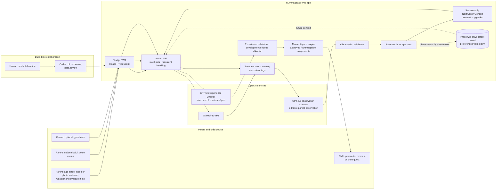

# RummageLab

> Turn the things around you into moments of discovery for ages 0–6.

**Status:** Planning and scaffold · **Track:** Education

RummageLab helps a parent turn a few ordinary objects and a child’s curiosity
into a developmentally appropriate moment of discovery. Every activity ends with
something the child noticed, made, heard, measured, or explained—not another
chat transcript.

## The core experience

1. A parent chooses an age stage, photographs a few safe household objects or
   types their materials, then confirms the small material inventory the app
   suggests. Live conditions for the editable **Anchorage, Alaska** demo default
   preselect broad weather tags; the parent changes or approves them before they
   shape the plan.
2. GPT-5.6 uses the approved activity context to produce a structured `ExperienceSpec`: a parent-led
   `RummageMoment` for ages 0–3, or a short `QuestSpec` for ages 3–6.
3. For children 3+, RummageLab can render an approved interactive
   **RummageTool**. For younger children, it gives the parent a simple co-play
   script rather than putting the child in front of a screen.
4. A parent can optionally leave a brief voice reflection or type a note. The
   system derives an editable, parent-owned observation and uses only approved
   next-activity tags to suggest what to try next.

The first planned demonstrable experience is **“Kitchen Sound Detectives”**:
a parent photographs two empty plastic containers, a wooden spoon or silicone
spatula, and a dish towel. After confirming the app’s safe-item suggestions,
they and their 3-year-old explore loud/quiet, fast/slow, and simple sound
patterns. No learner-facing experience has been implemented yet.

## Architecture



See [the detailed architecture](docs/architecture.md).

## Why GPT-5.6 and Codex

### GPT-5.6 at runtime

- Uses object photos and parent-provided context to compose a constrained,
  developmentally appropriate moment or quest.
- Returns structured data that the server validates before it reaches the child.
- Turns a parent reflection into a small, editable observation rather than a
  child diagnosis or opaque score.

### Codex collaboration

- **Core `/feedback` Session ID:** `TBD — record before submission`
- **Codex accelerated:** project scaffolding, interaction design, schemas,
  tests, documentation, and code review.
- **Human decisions:** learner scope, standards allowlist, safety/privacy
  boundaries, product direction, and final approval.
- **Evidence:** dated commits and [Codex decision log](docs/codex-decisions.md).

For the hackathon, Codex is used materially at build time to create and verify
the product. At runtime, GPT-5.6 selects a validated `RummageToolSpec` and the
app renders it with approved, prebuilt React components. A teacher/parent
authoring studio is documented phase-two scope; even then, the learner app will
never execute arbitrary generated code.

## Technology choices

| Concern | Choice | Why |
| --- | --- | --- |
| Product surface | Next.js, React, TypeScript | Fast public deployment, phone-friendly, easy judge access |
| Source and hosting | Public [GitHub repository](https://github.com/hqt08/RummageLab) + planned Vercel deployment | Reviewable source now; PR previews and a stable production URL after deployment |
| Model contracts | GPT-5.6 + Zod structured schemas | Consistent, inspectable, parent-safe rendering boundaries |
| Reflection MVP | Optional parent memo or typed note | More reliable than live voice; raw media stays transient |
| Data | Seeded, no-login parent context; preferences later | Keeps the demo reliable without sensitive child data |
| Weather | Anchorage demo default suggests tags; parent approves | Convenient live context without sending location to the model |
| Interactive activity | Prebuilt React RummageTool components | Instant, safe, testable experience |
| Styling | CSS field-notebook design system | Tactile and playful without a generic AI interface |

## Scaffold setup

Prerequisite: Node.js 24 LTS and Corepack using the project-pinned
`pnpm@9.15.9`. The repository's `.node-version` and `engines.node` both select
Node 24.

```bash
corepack enable # omit if pnpm 9.15.9 is already installed
pnpm install --frozen-lockfile
cp .env.example .env.local
pnpm dev # starts the intentional placeholder route
```

Open `http://localhost:3000` to verify the framework is wired correctly. It will
show only a scaffold placeholder until implementation is explicitly approved.

When model integration starts, set `OPENAI_API_KEY` and keep it server-side.
See [`.env.example`](.env.example).

## Framework checks

```bash
pnpm test
pnpm typecheck
pnpm check
```

The combined scaffold check currently passes under Node 24. Initial contract
tests cover the material, age-band, standards, and RummageTool safety boundaries.
UI/API tests and an automated smoke-test script remain intentionally deferred
until the first behavior slice is approved.

## Planned demo path

1. Open the app.
2. Select the seeded **Kitchen Sound Detectives** activity.
3. Co-play the sound, rhythm, and turn-taking prompts with a 3-year-old.
4. Review the parent-safe activity constraints and parent-approved observation.

Before implementation, turn this into an executable acceptance test. Before
submission, add the public URL, demo credentials if applicable, and the final
under-three-minute demo video. Use the
[submission checklist](docs/submission-checklist.md) rather than relying on
memory.

## Documentation

- [Architecture and data contracts](docs/architecture.md)
- [Early-learning focus catalogue](docs/learning-focuses-catalog.md)
- [Privacy and safety boundaries](docs/privacy-safety.md)
- [Parent observations and adaptive suggestions](docs/observation-model.md)
- [Demo script](docs/demo-script.md)
- [Photo-to-activity demo flow](docs/photo-to-activity-demo.md)
- [Activity-context contract](docs/activity-context.md)
- [Codex decision log](docs/codex-decisions.md)
- [Submission checklist](docs/submission-checklist.md)
- [Repository, worktree, and deployment workflow](docs/repository-workflow.md)
- [Product-owner decision record](human.md)

## License

Copyright © 2026 hqt08.

RummageLab source code and documentation are licensed under the
[Apache License 2.0](LICENSE).

The license does not grant permission to use RummageLab trade names,
trademarks, service marks, or product names except as the license permits for
describing the work's origin. Demo media and third-party assets are not covered
unless their files explicitly say otherwise.
