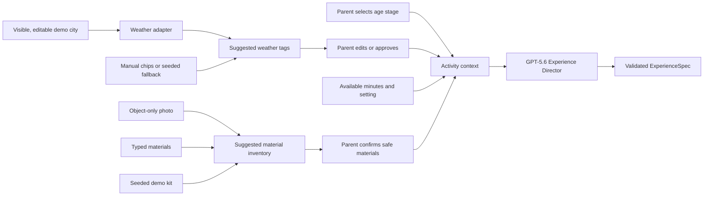

# Activity-context contract

## One planning input, three material routes

RummageLab accepts materials in three ways:

1. an object-only photo;
2. typed material names; or
3. the included Kitchen Sound Detectives fixture.

All routes converge before planning. The model may use only the confirmed,
allowed material inventory—not raw image bytes or raw typed text.
`MaterialInputSchema` exists only on the pre-confirmation side of this boundary.
`ActivityContextSchema` carries source provenance plus normalized, allowlisted
categories; it contains no raw input or free-form material label.



## Context allowed to influence a suggestion

| Input | Example | Storage rule |
| --- | --- | --- |
| Age stage | `3-4y` | Parent-selected; session-only in demo |
| Confirmed materials | plastic container, wooden spoon, dish towel | Session-only; no raw photo/text retained |
| Weather | rainy, cold | Parent-approved normalized tags only; no location retained |
| Time | 8 minutes | Session-only |
| Setting | indoors | Session-only |
| Parent-approved preference tags | sound play, turn taking | Session-only in demo; future only after review |

## Weather design

The hackathon flow begins with **Anchorage, Alaska** as a visible, editable public
demo default. This is application configuration, not an inferred child/family
location. A server-side weather adapter suggests friendly chips such as `sunny`,
`rainy`, `windy`, `snowy`, `hot`, `cold`, or `not sure`. The parent must edit or
approve the selection before continuing. Only that approved tag set enters
activity planning; the model never receives the city, coordinates, or provider
payload. Do not request precise GPS location.

The implemented seeded slice keeps that city label in React memory only and
never copies it into `ActivityContext`. It preselects the clearly prepared
`rainy` and `cold` chips, exposes all eight normalized manual choices, limits
the final set to four, and invalidates approval whenever a chip changes. There
is no lookup or provider request in this slice; reset or reload restores the
Anchorage label and prepared tags.

### Provider recommendation and deterministic mapping

Open-Meteo is the leading prototype choice because it combines global city
geocoding and current weather in simple JSON APIs. Its hosted free endpoint is
non-commercial, rate-limited, has no uptime guarantee, and requires attribution;
confirm that the intended public demo use fits its current terms before launch.
The self-hosted server is AGPLv3 and API data is CC BY 4.0. If the selected demo
city is in the United States, the National Weather Service is a strong
authoritative alternative, though it needs coordinates rather than a city name.

Map raw weather to suggested chips in deterministic application code, not with
an LLM. The initial product heuristics may use current snowfall or WMO snow codes
for `snowy`, rain/showers or precipitation codes for `rainy`, apparent
temperature thresholds for `cold` and `hot`, and wind/gust thresholds for
`windy`. These are convenience suggestions, not safety determinations. Show the
underlying plain-language condition and let the parent change every chip.

Cache the city resolution and current conditions briefly, use a short request
timeout, and fall back to manual or clearly labeled seeded tags on failure. A
future Settings screen may let the parent edit, clear, or disable the city. The
city must not enter model prompts, observations, activity-preference memory,
analytics, or content logs.

Provider references:

- [Open-Meteo forecast and current-weather API](https://open-meteo.com/en/docs)
- [Open-Meteo city geocoding API](https://open-meteo.com/en/docs/geocoding-api)
- [Open-Meteo hosted API terms and pricing](https://open-meteo.com/en/pricing)
- [National Weather Service API documentation](https://www.weather.gov/documentation/services-web-api)

## Example: Kitchen Sound Detectives

```json
{
  "ageStage": "3-4y",
  "materialSource": "photo",
  "confirmedMaterials": [
    { "allowedMaterialCategory": "large_empty_plastic_container", "parentConfirmed": true },
    { "allowedMaterialCategory": "wooden_kitchen_utensil", "parentConfirmed": true },
    { "allowedMaterialCategory": "soft_cloth", "parentConfirmed": true }
  ],
  "weather": {
    "source": "weather_lookup",
    "approvedTags": ["rainy", "cold"],
    "parentApproved": true,
    "preciseLocationStored": false
  },
  "availableMinutes": 8,
  "setting": "indoors",
  "parentConfirmedSafety": true
}
```

The suggested activity can therefore be relevant to the items, age stage, time,
and an indoor rainy day—without storing identity or location data.
