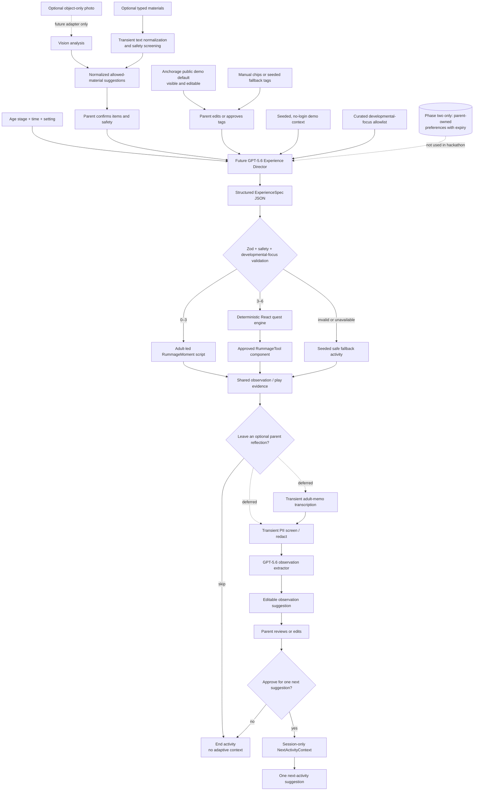

# Architecture

## Product boundary

The model plans an age-appropriate moment or quest; the application renders or
guides it. Models do not send executable code to a learner’s browser.



## Core contracts

### `ExperienceSpec`

The system selects a safe, age-appropriate experience shape. It is a union of:

- `RummageMomentSpec` for parent-led `0–12 months` and `12–36 months` co-play.
- `QuestSpec` for parent-guided `3–4 years` and `4–6 years` investigations.

### `RummageMomentSpec`

This is deliberately non-screen-first. It includes an adult script, approved and
forbidden material categories, an adult-supervision flag, a `stopIf` boundary,
and a parent observation prompt. It must never ask for a child voice recording
or infer mastery.

### `QuestSpec`

A server-validated plan for a single 8–15 minute guided quest. It includes:

- a parent-selected age stage and one or more approved developmental-focus IDs
- an optional reviewed kindergarten-standard ID for the `4–6 years` band only
- objective, materials, adult safety note, and time-boxed steps
- a success-evidence prompt and a parent reflection prompt
- exactly one `RummageToolSpec`
- a fallback path if the live model request fails

### `RummageToolSpec`

The child-facing name is **RummageTool**. It is a discriminated union of only
these kinds:

```text
sort | measure | predict | sound_mix | field_journal
```

It contains display and interaction configuration only. It may never include
script source, raw HTML, package names, URLs to execute, or shell commands.

### `ParentReflection` and `NextActivityContext`

`ParentReflection` is optional input from a parent, either typed text or a
transcribed parent memo. It is not a child recording. It produces a small,
parent-reviewable observation plus a `NextActivityContext` containing only
approved tags such as `sound_play`, `two_beat_pattern`, or `turn_taking`.

The context feeds one next-activity suggestion and is session-only in the
hackathon demo. It is not a diagnosis, grade, milestone assessment, psychological
profile, or permanent profile of the child.

## Runtime sequence

1. Render a parent-facing photo/camera shell immediately, with an explicit
   “objects only; no people” reminder.
2. The implemented server-only runtime seam has provider-neutral `PhotoInventoryRequest` and
   `ExperienceRequest` contracts. They omit raw bytes, typed text, filenames,
   prompts, and provider payloads; a future server adapter owns transient upload
   handling. The sole current provider is deterministic and seeded.
3. In a future live flow, request a constrained `PhotoInventory` from an
   object-only image. In the current seeded path, load the matching fixture.
   Both paths use the same schema and require parent confirmation.
4. Typed materials and photo suggestions use the same material-confirmation and
   safety path. Require parent confirmation before activity planning.
5. The current weather tags are prepared chips; a live weather adapter is
   deferred. Only parent-approved broad tags could ever enter planning.
6. A future adapter sends one context-rich request for an `ExperienceSpec`; avoid a chain of model
   calls before the child can begin.
7. Validate the response and its age, time, focus-ID, and confirmed-material
   compatibility before rendering the corresponding prebuilt component. Malformed,
   mismatched, unavailable, and timeout outcomes map to a content-free taxonomy
   and a validated seeded fallback.
8. Keep only minimum session-local experience state; use no database or durable
   child-related storage in the hackathon demo.
9. Typed reflection and adult voice processing are deferred and remain off the
   critical path until separately implemented and reviewed.

## Hackathon data posture

The initial demo has one seeded, no-login parent context. It should not create
accounts or persist a real child's information. A future parent-owned activity
preference feature would require explicit controls, authentication, deletion,
expiry, and additional privacy review.

## Latency and resilience targets

| Moment | Target behavior |
| --- | --- |
| Photo inventory | Immediate local shell; deterministic seeded fixture and contract fallback are available |
| Quest start | Immediate local shell and parent-confirmed materials checklist |
| Runtime preview | Client-local deterministic state with visible loading, fallback, and retry; no runtime planner/network request |
| Interactive tool | Local rendering; no model round-trip per tap |
| Parent reflection | Prepared review only; typed reflection and voice are deferred |
| Failure | Seeded or cached quest remains available |

## Phase two: teacher/parent Studio

This is documented phase-two scope and is not part of the hackathon demo. Codex
remains a build-time collaborator; the learner runtime accepts only validated
`RummageToolSpec` data and renders prebuilt components. A future adult-facing
Studio may produce a spec from constrained templates, validate it, preview it,
and require an adult to publish it. It must not generate arbitrary production
code to execute in the main app.
