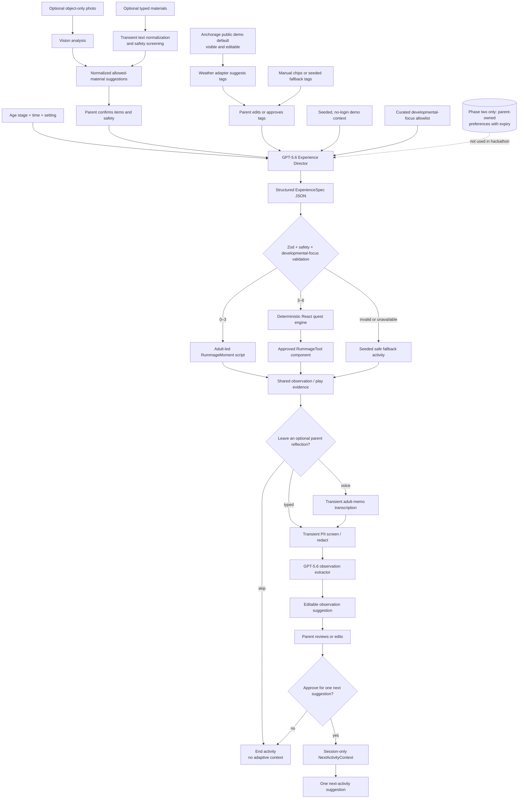

# Architecture

## Product boundary

The model plans an age-appropriate moment or quest; the application renders or
guides it. Models do not send executable code to a learner’s browser.



## Core contracts

### `ExperienceSpec`

The system selects a safe, age-appropriate experience shape. It is a union of:

- `RummageMomentSpec` for parent-led `0–12 months` and `12–36 months` co-play.
- `QuestSpec` for parent-guided `3–4 years` and `4–6 years` investigations.

### `RummageMomentSpec`

This is deliberately non-screen-first. It includes an adult script, approved and
forbidden material categories, an adult-supervision flag, a `stopIf` boundary,
and a parent observation prompt. It must never ask for a child voice recording
or infer mastery.

### `QuestSpec`

A server-validated plan for a single 8–15 minute guided quest. It includes:

- a parent-selected age stage and one or more approved developmental-focus IDs
- an optional reviewed kindergarten-standard ID for the `4–6 years` band only
- objective, materials, adult safety note, and time-boxed steps
- a success-evidence prompt and a parent reflection prompt
- exactly one `RummageToolSpec`
- a fallback path if the live model request fails

### `RummageToolSpec`

The child-facing name is **RummageTool**. It is a discriminated union of only
these kinds:

```text
sort | measure | predict | sound_mix | field_journal
```

It contains display and interaction configuration only. It may never include
script source, raw HTML, package names, URLs to execute, or shell commands.

### `ParentReflection` and `NextActivityContext`

`ParentReflection` is optional input from a parent, either typed text or a
transcribed parent memo. It is not a child recording. It produces a small,
parent-reviewable observation plus a `NextActivityContext` containing only
approved tags such as `sound_play`, `two_beat_pattern`, or `turn_taking`.

The context feeds one next-activity suggestion and is session-only in the
hackathon demo. It is not a diagnosis, grade, milestone assessment, psychological
profile, or permanent profile of the child.

## Runtime sequence

1. Render a parent-facing photo/camera shell immediately, with an explicit
   “objects only; no people” reminder.
2. In a live flow, request a constrained `PhotoInventory` from the image. In the
   seeded fallback, load the matching fixture. Both paths use the same schema.
3. Typed materials and photo suggestions use the same material-confirmation and
   safety path. Require parent confirmation before activity planning.
4. Let the weather adapter suggest optional normalized tags, then require parent
   edit or approval. Send only the approved tags to the Experience Director; do
   not retain precise location, raw provider data, or the city in model context.
5. Send one context-rich request for an `ExperienceSpec`; avoid a chain of model
   calls before the child can begin.
6. Validate the response and render the corresponding prebuilt component.
7. Keep only minimum session-local experience state; use no database or durable
   child-related storage in the hackathon demo.
8. Transcribe and analyze an opt-in adult memo after play, not on the critical
   path. Raw audio is transient and deleted after transcription; typed notes
   skip transcription. Screen transient text before observation extraction.

## Hackathon data posture

The initial demo has one seeded, no-login parent context. It should not create
accounts or persist a real child's information. A future parent-owned activity
preference feature would require explicit controls, authentication, deletion,
expiry, and additional privacy review.

## Latency and resilience targets

| Moment | Target behavior |
| --- | --- |
| Photo analysis | Immediate camera shell; seeded fixture is available when live analysis fails |
| Quest start | Immediate local shell and parent-confirmed materials checklist |
| Model planning | One streaming request, with a playful progress state |
| Interactive tool | Local rendering; no model round-trip per tap |
| Parent reflection | Optional background processing after a memo; typed notes are immediate |
| Failure | Seeded or cached quest remains available |

## Phase two: teacher/parent Studio

This is documented phase-two scope and is not part of the hackathon demo. Codex
remains a build-time collaborator; the learner runtime accepts only validated
`RummageToolSpec` data and renders prebuilt components. A future adult-facing
Studio may produce a spec from constrained templates, validate it, preview it,
and require an adult to publish it. It must not generate arbitrary production
code to execute in the main app.
