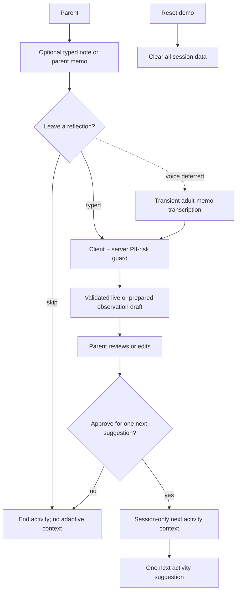

# Parent observations and adaptive suggestions

## The product promise

RummageLab remembers only enough of what a parent chose to share to make the
**next activity** feel more relevant. It does not build a psychological profile
of a child.

Use parent-facing labels:

- **What you noticed** — a short editable summary of the parent’s own report.
- **Try next** — one optional activity suggestion and why it connects.

Do not use labels such as “learning profile,” “mastery,” “ability,” “behavior
risk,” “developmental score,” or “assessment.”

## Input boundary

Reflection is optional. A parent can:

1. skip it;
2. type up to 400 characters; or
3. in a future slice, record a short parent-only memo for transcription after
   the activity.

The experience must not solicit or record a child’s voice. The parent is reminded
not to include names, medical details, school information, diagnoses, or other
sensitive details in the memo/text.

Because free text can accidentally contain PII, the implemented typed flow warns
the parent, avoids content logging, and discards transient input. A shared,
deterministic and conservative PII-risk guard runs in the browser before any
request and again on the server before observation extraction. A blocked note is
not sent; the parent can remove the detail or Skip. This does not promise perfect
PII detection. For a future opt-in adult voice memo, raw
audio reaches transient transcription first unless transcription is local; the
audio is then deleted, and the transcript is screened before observation
extraction and discarded afterward. This is defense in depth, not a claim that
automated detection is perfect.

## Demo lifecycle



For the hackathon:

- no database;
- no login or stable child ID;
- no raw photo, raw audio, transcript, or observation retained after the browser
  session; and
- no raw reflection history sent to a later model request.

## What may feed the next suggestion

Only a short, parent-editable `NextActivityContext` can be used. Examples:

```json
{
  "source": "parent_approved",
  "interestTags": ["sound_play", "two_beat_pattern"],
  "supportTags": ["turn_taking"],
  "useFor": "next_activity_only",
  "expires": "end_of_demo_session",
  "parentEditable": true
}
```

The parent can edit or delete every tag before it is used. The model receives
these tags—not the original voice recording, raw reflection, or free-text
observation—when it proposes a next activity.

Good: “After I tapped two containers, she pointed to the louder one and asked
‘again.’”

Not acceptable: “She is musically gifted,” “has strong auditory processing,” or
“has mastered sound discrimination.” The product records a parent-reported event,
not an interpretation of the child.

## What must never be inferred or stored

- diagnoses, medical information, disability labels, or mental-health claims;
- personality traits, behavioral-risk scores, or predictions;
- “ability,” “mastery,” aptitude, or intelligence scores;
- a child’s voice, face, full name, school, exact location, or account ID;
- an invisible cumulative behavior history; or
- a model-generated claim about the child that the parent did not review.

## Model-request boundary

Treat a parent reflection as untrusted content. A model request should:

1. include the allowed tag schema and explicit prohibition on diagnosis/profiling;
2. keep reflection text clearly separated from instructions;
3. return structured data only;
4. validate the result server-side; and
5. require parent approval before next-activity use.

The implemented route additionally enforces strict character and byte bounds,
rejects unknown request fields, uses a closed content-free error taxonomy, and
screens every free-text field returned by the provider. Missing credentials,
timeouts, malformed or unsafe output, and provider failures return a transparent
prepared draft. That draft is still unapproved: the parent may edit its wording
and tags, and only the separately approved allowlisted tags create the
session-only `NextActivityContext`. Raw reflection and observation wording never
enter the next recommendation.

The live OpenAI integration does not rely on stored conversation or thread
state and sends `store: false`. That application setting does not replace a
deployment review of current endpoint retention behavior. OpenAI documents
default abuse-monitoring and application-state retention, as well as available
retention controls, in its [API data controls documentation](https://platform.openai.com/docs/models/default-usage-policies-by-endpoint).

## Future persistent mode

Persistent parent-owned notes are out of scope for the hackathon. A future
product can reasonably remember **parent-selected activity preferences** without
creating a child assessment, but only after privacy/legal review and an explicit
parent-control design.

The future storage boundary should be a small `ActivityPreferenceContext`, for
example:

```json
{
  "source": "parent_selected",
  "ageStage": "3-4y",
  "interestTags": ["sound_play", "movement_play"],
  "activityLength": "short",
  "recentApprovedContext": ["two_beat_pattern", "turn_taking"],
  "expiresAt": "parent-selected date"
}
```

This record must contain no child name, date of birth, raw memo, transcript,
photo, score, trait, diagnosis, or inferred ability. The model receives only the
minimum approved tags needed to make the next play invitation more relevant.

Every saved field must be explicit and parent-selected, carry a clear expiry,
and remain editable/deletable. Do not automatically promote a model inference
into saved preferences.

Before adding it, implement authenticated parent controls, data export/deletion,
clear retention limits, and consent flows where required. The FTC’s [COPPA guidance](https://www.ftc.gov/business-guidance/resources/childrens-online-privacy-protection-rule-not-just-kids-sites)
is an important starting point, not a substitute for counsel.

The retention period for a future mode is deliberately unresolved; do not build a
database or history feature until the product owner approves that policy.
