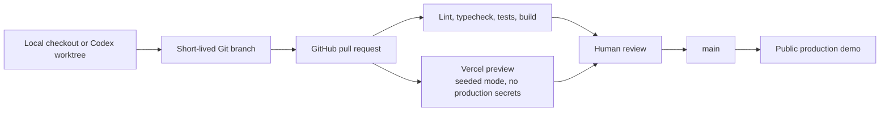

# Repository, worktree, and deployment workflow

## Decisions

- Public source repository: `https://github.com/hqt08/RummageLab`.
- Primary branch: `main`; it remains the production and integration branch.
- GitHub initialized `main` with only the standard Apache-2.0 `LICENSE`; local
  `main` tracks that commit and the remaining scaffold is not yet committed.
- Hackathon commit identity: repository-local
  `hqt08 <1230758+hqt08@users.noreply.github.com>`.
- Public app: GitHub stores the source; Vercel is the confirmed Next.js host.
- Local execution remains the demonstration fallback.
- No feature implementation or production deployment exists yet.

## Publish-readiness gate

Do not push the first scaffold commit until all of these are true:

- the Apache-2.0 `LICENSE` and package metadata are present;
- the repository-local Git author remains the confirmed and verified GitHub
  no-reply identity;
- the pnpm version is pinned and `pnpm-lock.yaml` is committed;
- dependencies install and `pnpm check` passes;
- a final tracked-file secret and private-data scan is clean; and
- `origin` points to the public `hqt08/RummageLab` repository.

The current scaffold installs reproducibly from `pnpm-lock.yaml` under Node 24.
`pnpm check` passes, the full dependency audit reports no known
vulnerabilities, and a production-server smoke check returns the intentional
placeholder page. Initial tests cover schema/safety contracts only; this is a
scaffold gate, not evidence that product behavior is tested.

The staged-file review found no credential patterns, private keys, raw media,
unexpected binaries, or oversized files. The only email is the intentional
GitHub no-reply identity. `.env*` files except `.env.example`, Vercel state,
build output, dependencies, test output, logs, local databases/uploads, and key
files are ignored.

`package.json` temporarily overrides Next 15's PostCSS dependency to patched
PostCSS 8.5.19. Re-evaluate and remove the override when a future Next.js update
no longer pins a vulnerable pre-8.5.10 release.

The `hqt08` name and no-reply address are the confirmed hackathon identity. A
future LLC name and email should be applied prospectively after an explicit
ownership decision; changing Git or README metadata alone does not transfer
existing rights.

## Worktree recommendation

Do **not** use a worktree for the current decision-and-scaffolding session. First
create a reviewed scaffold baseline commit on `main`. After that, use
Codex-managed worktrees selectively for independent slices that benefit from
parallel work.

Good candidates:

- `feat/photo-inventory`
- `feat/weather-adapter`
- `feat/kitchen-sound-demo`
- `test/safety-contracts`
- `docs/submission`

Avoid running parallel tasks that all rewrite shared hotspots such as
`src/app/page.tsx`, `src/app/globals.css`, the same schema, or the same demo
fixture. A worktree starts in detached `HEAD`; create a named branch before
pushing it. Git permits a branch to be checked out in only one worktree at a
time. Use Handoff to bring a task to Local when final inspection, one shared dev
server, or integrated testing is easier there.

Ignored local files do not normally follow a managed worktree. If live API work
later requires a development `.env.local`, consider a minimal `.worktreeinclude`
entry. Copy only development credentials, never production credentials, and do
not add this until a worktree actually needs it.

Official reference: [Codex Git worktrees](https://learn.chatgpt.com/docs/environments/git-worktrees).

## Hosting shape

Vercel was selected instead of GitHub Pages because RummageLab plans server-side model,
transcription, and weather-adapter routes with private credentials. GitHub Pages
is a static host and would require a separate backend. Standard Next.js does not
need a `vercel.json` file initially.

Hosting references:

- [Vercel Git deployments and production branches](https://vercel.com/docs/git)
- [Vercel preview and production environment variables](https://vercel.com/docs/environment-variables)
- [Creating a GitHub Pages site](https://docs.github.com/en/pages/getting-started-with-github-pages/creating-a-github-pages-site)

Deployment boundaries:

- production deploys only from `main`;
- pull requests receive preview URLs;
- previews default to seeded demo mode and do not need the production OpenAI key;
- `OPENAI_API_KEY` is server-only and must never use a `NEXT_PUBLIC_` prefix;
- production and preview environment variables are configured separately;
- deploy logs must not contain prompts, photos, transcripts, or parent notes; and
- the README receives the public production URL only after it works in a fresh,
  signed-out browser.
